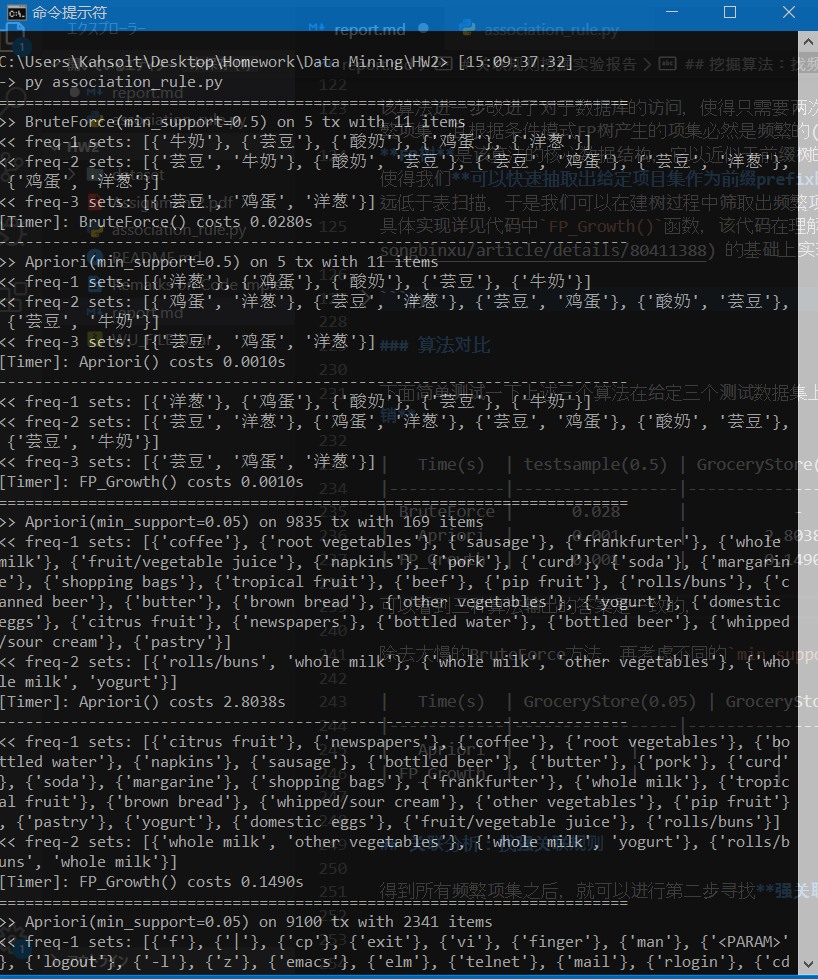
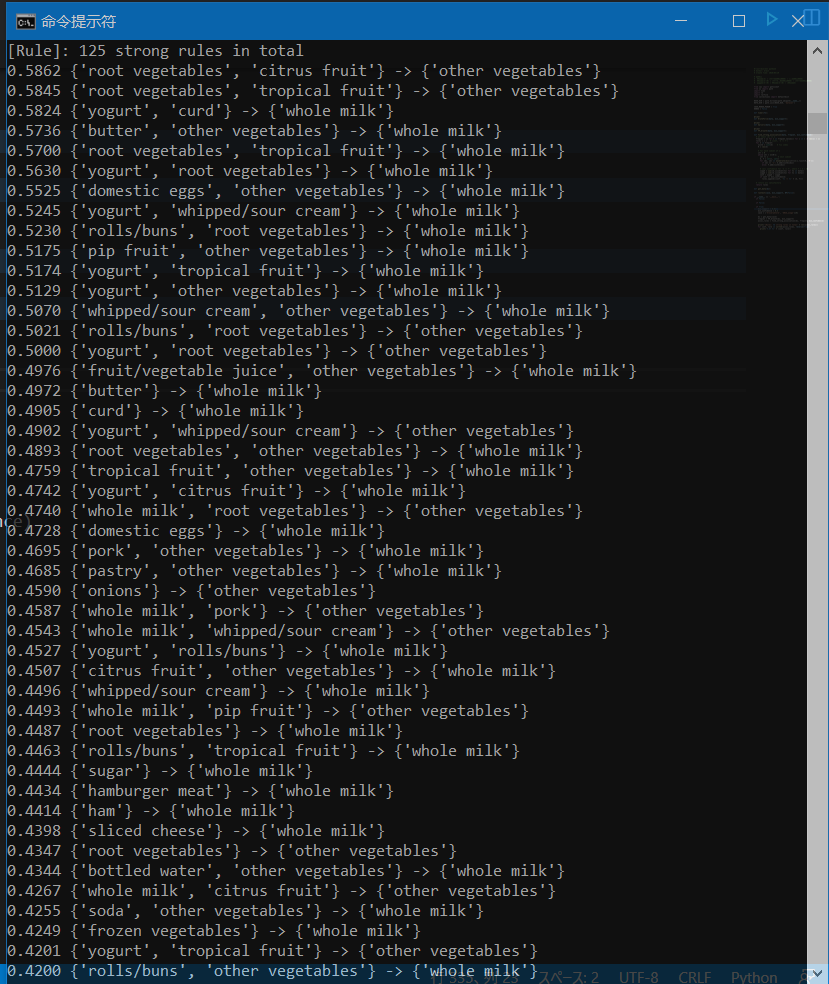

# 关联规则挖掘实验报告

    这里是数据挖掘入门课程HW2的实验报告
    主要内容：关联规则挖掘问题介绍、示例数据集及其预处理过程、三种常见算法思想及其实现、示例数据集上的挖掘结果

----

## 问题引入

在购物篮分析、音乐推荐、输入法预测等实际应用中，抽象出了**关联规则**的概念，用以描述和预测给定的对象集的强关联结果集。  
个人感觉关联规则挖掘可以视作文本上的同现词分析的一种扩展、因此和同现词分析相似地，待分析**数据集由若干个事务Transaction组成、每个事务是一个含有若干项目Item的无序集合**，以下是一些记号约定和定义：

  - 总事务数: `nTrans` = 事务数量、通常亦即数据表的行数
  - 总项目数: `nItems` = 去重后的项目数量、亦即所有事务广义并集的大小
  - 项目集的频度: `frequency(X)` = 含项目集X的记录数，eg. `frequency({西瓜,书})`

而基本的**关联规则**是形如`X->Y`的蕴涵式(eg. `{西瓜,书} -> {薄荷糖}`)，其中项目集`X`和`Y`分别称为规则的先导和后继，在关联规则上定义以下用于评估的属性：

  - 支持度: `support(X->Y)` = `frequency(X∪Y})` / `nTrans`
  - 置信度: `confidence(X->Y)` = `frequency(X∪Y)` / `frequency(X)`
  - 提升度: `lift(X->Y)` = `confidence(X->Y)` / `support(X)`

自然地，基本的关联规则还可以进一步扩展为带连接词的**多维度关联规则**，即形如`φ(X1,X2,..,Xn) -> ψ(Y1,Y2,..,Ym)`的蕴涵式。

回到问题，抽象地说**关联规则挖掘**分为两个步骤：

  - 枚举所有**频繁项集**，即那些在不同事务中同现频率不小于给定最小支持度`min_support`的项目集
  - 对于每个频繁项集、产生**强关联规则**，即那些从频繁项集中任意选择两个子集分别作为先导和后继产生的置信度不小于给定最小置信度`min_confidence`的规则

第二个步骤通常来说只能暴力枚举子集即可，通常频繁项集不会太大、因而指数时间算法也是实践上可接受的。   
但第一个步骤如果使用子集枚举，则会因为数据量过大从而在实践上几乎不可行，因此需要考虑更好的算法，如Apriori、FP-Growth等。  


## 数据集 & 预处理

本此实验中使用了三个数据集：

  - 测试小样例`testsample`: nTrans = 5, nItems = 11
  - 商店购物交易`GroceryStore`:  nTrans = 9835, nItems = 169
  - Linux命令会话记录`UNIX_usage`: nTrans = 9100, nItems = 2341

由于是已清洗过的数据，数据预处理步骤很简单、整理成 **项目集之列表`[{item}]`** 形式即可，详见代码`get_data()`函数  
**注**: 第三个数据集`UNIX_usage`中，我们可以把指明参数具体数量形如`<\d+>`的项统一再抽象成单一的`<PARAM>`/甚至直接丢掉，代码中通过开关`CASE_MERGE_PARAM`来控制  

此处展示第一个数据集的形态，以便读者形成一些基础的直观：

```py
#ds = get_data('testsample')
ds = [{'牛奶','洋葱','肉豆蔻','芸豆','鸡蛋','酸奶'},   # 共5个事务，每行一个
      {'莳萝','洋葱','肉豆蔻','芸豆','鸡蛋','酸奶'},   # 共11个不同的项目
      {'牛奶','苹果','芸豆','鸡蛋'},
      {'牛奶','独角兽','玉米','芸豆','酸奶'},
      {'玉米','洋葱','芸豆','冰淇淋','鸡蛋'}]
```


## 挖掘算法：找频繁项集

各种挖掘算法主要解决关联规则挖掘的第一个步骤，即寻找所有**频繁项集**。

### 子集枚举算法

即暴力枚举，检查去重项目集的`2^|nItems|`个子集、逐个计算支持度并保留满足条件的子集；具体实现详见代码中`BruteForce()`函数，这里仅列出算法框架如下：

```py
def BruteForce(data, min_support):
  for subset in 项目集的幂集:
    supp = freqency(subset) / nTrans
    if supp >= min_support:
      yield subset
```

显然该算法的时间复杂度是指数级别`O(2^n)`、从数据库访问角度考虑也需要扫描指数级次数据库，以至于在第一个小样例数据集上运行时间0.03s尚且能接受、而在另外两个大数据集上运行了近5min仍然不能给出结果。  

### Apriori算法

该算法的名称来源于其所使用的一个先验知识(a priori rule)，即：**频繁项集的子集必定是频繁项集，非频繁项集的超集必定是非频繁项集**。  
根据这条规则可知，只有频繁的k项集才**有可能**组合出频繁的(k+1)项集，故我们只需按项集的大小由小到大来逐个生成并检查候选子集、就可以减少许多不必要的子集检查；具体实现详见代码中`Apriori()`函数，这里仅列出算法框架如下：

```py
def Apriori(data, min_support):
  # 初始时，产生 1-候选项集
  k = 1
  Ck = [{it} for it in 项目集]

  # 重复，直到候选子集为空
  while Ck:
    # 从 k-候选项集 按min_support筛选产生 k-频繁项集
    cntr = defaultdict(int)
    for cid, c in enumerate(Ck):
      for tx in data:
        if c.issubset(tx):
          cntr[cid] += 1               # 计算每个候选项集的频度 frequent(c)
    Cfreq = [ ]
    for cid, freq in cntr.items():
      supp = freq / nTrans             # 由频度得到支持度
      if supp >= min_support:
        Cfreq.append(Ck[cid])          # 按最小支持度过滤
    
    # 如果没有 k-频繁项集 则结束
    if not Cfreq: break
    # 否则记录新找到的频繁项集
    else: yield Cfreq 
    
    # 从 k-频繁项集 组合产生 (k+1)-候选项集
    Ckk = [ ]      
    for i in range(len(Cfreq)-1):
      for j in range(i+1,len(Cfreq)):
        cc = Cfreq[i] | Cfreq[j]       # k-频繁项集 中两两组合
        if len(cc) == k + 1:           # 迭代步进为1，即只考虑大小为k+1的子集
          Ckk.append(cc)               # 加入 (k+1)-候选项集
    
    # Ck随着迭代主元k而更新
    k += 1
    Ck = Ckk
```

算法流程基本是线性的、已经在注释中逐步给出了，核心循环是`[从 k-候选项集 筛选出 k-频繁项集] -> [从 k-频繁项集 组合出 (k+1)-候选项集]`对于迭代主元k的步进，其余细节不再赘述。  
该算法的复杂度对输入数据信息的依赖性较强、在最坏的情况下时间复杂度和空间复杂度都依旧会退化到指数级别，但在实践应用中这种剪纸效果非常好。另一方面，可以从数据库访问的角度来考虑，随着每次k的步进都会扫描一遍数据库，故最多扫描`|nItems|`常数次数据库，对比BF来说也个极大的改进。  

### FP-Growth算法

该算法进一步改进了对于数据库的访问，使得只需要两次扫描数据库、一次建立总的**FP树**，就可以在接下来不断地递归建立若干个**条件模式FP树**的过程中产生所有频繁项集，且根据条件模式FP树产生的项集必然是频繁的(这在建树时就保证了)，从而避免了"先生成、再过滤"模式中大量不合格项集的产生，从而优化了时空复杂度。  
**FP树**是该算法的核心数据结构，它以近似于前缀树的方式按频序存储了每个事务的**项目链**、又在同名链节点之间引入了单向链表串起来方便枚举访问。这个数据结构使得我们**可以快速抽取出给定项目集作为前缀prefix时，包含它的所有事务(仅仅与之相关的事务!!)**，由此，递归建树的过程就相当于原来的数据库表扫描、但复杂度远低于表扫描，于是我们可以在建树过程中筛取出频繁项集；更详细的介绍请参考论文或者代码注释或者百度。  
具体实现详见代码中`FP_Growth()`函数，该代码在理解了CSDN上的博文 [https://blog.csdn.net/songbinxu/article/details/80411388](https://blog.csdn.net/songbinxu/article/details/80411388) 的基础上实现并做了优化，这里仅列出算法框架如下：

```py
def FP_Growth(data, min_support):
  
  class Node:    # 一个FP树节点
  
    def __init__(self, value='Ø', count=0, parent=None):
      self.value = value    # item name
      self.count = count    # partial count in a string cluster
      self.next = None      # as linklist
      self.parent = parent  # as tree
      self.children = { }   # as tree, {'item': Node}

  class Head:    # 一个链表头
  
    def __init__(self, value, count=0, next=None):
      self.value = value    # item name
      self.count = count    # total count
      self.next = next      # Node

  class FPTree:  # 一棵FP树
    
    def __init__(self, root=None, head=None):
      self.root = root    # 根节点，Node
      self.head = head    # 一组链表头，{'item': Head}
    
    @classmethod
    def create(cls, data, min_count=1):
      # 项目计数，然后按min_count过滤非频繁项
      cntr = defaultdict(int)   # {'item': count}
      for tx, cnt in data.items():
        for it in tx:
          cntr[it] += cnt
      freq_items = {it for it, cnt in cntr.items() if cnt >= min_count}
      if not freq_items: return None
      
      # 建立FPTree
      root = Node()   # 最顶部的形式空节点
      head = {it: Head(it, cntr[it]) for it in freq_items}  # {'item': Head}
      fptree = cls(root, head)
      
      # 将每个事务链条合并到FPTree上
      for tx, cnt in data.items():
        frq_it = {it: head[it].count for it in tx if it in freq_items}
        if frq_it:
          # 每个事务内的项目按总频度逆序排序，做成一根链条
          it_srt = [v[0] for v in sorted(frq_it.items(), key=lambda p:(p[1], p[0]), reverse=True)]
          fptree.update(it_srt, cnt)
      
      # 返回构造完毕的FPTree
      return fptree
    
    def update(self, tx, cnt):
      def _update(tx, cur):
        if not tx: return
        it, rst = tx[0], tx[1:]   # 取出第一个项目
        if it in cur.children:    # 与原树同型就增加链子的粗细
          cur.children[it].count += cnt
        else:                     # 树有新分支
          # 插入到树中
          cur.children[it] = Node(it, cnt, cur)
          # 插入到链表中
          cur.children[it].next = self.head[it].next
          self.head[it].next = cur.children[it]
        _update(rst, cur.children[it])    # 递归合并链子剩下的部分
      _update(tx, self.root)              # 从树根开始合并
    
    def prefix_path(self, base_item):
      ret = { }  # {'path': count}
      # 收集头链表中给定基的所有链子
      node = self.head[base_item].next
      while node:
        cur, prf_path = node, [ ]
        while cur.parent:        # 以给定项目为基在FPTree上溯形成前缀集合
          prf_path.append(cur.value)
          cur = cur.parent
        if len(prf_path) > 1:             # ignore the base item
          ret[frozenset(prf_path[1:])] = node.count  # count of the base item
        node = node.next
      return ret
    
    def find_freqset(self, min_count):
      def _find_freqset(fptree, min_count, prefix):
        # 1-frequent directly from headlist
        if not fptree or not fptree.head: return
        C1 = fptree.head.keys()
        # for each freqset extend to new freqset
        for base_item in C1:
          nfreqset = prefix.copy()
          nfreqset.add(base_item)
          yield nfreqset                 # 找到新的频繁项集
          # 在新的前缀上创建新的条件模式FPTree
          rdata = fptree.prefix_path(base_item)     # extract ONLY related records as data
          nfptree = FPTree.create(rdata, min_count) # conditional FPTree
          _find_freqset(nfptree, min_count, nfreqset)
      _find_freqset(self, min_count, set())   # from prefix = 'Ø'
  
  min_count = min_support * len(data)         # 转换为最小支持数
  ddata = {frozenset(tx):1 for tx in data}    # 整理数据为 {set: count} 的形式
  fptree = FPTree.create(ddata, min_count)    # 建立总的FPTree
  fptree.find_freqset(min_count)              # 寻找频繁项集
```

### 算法对比

下面简单测试一下上述三个算法在给定三个测试数据集上的运行性能(括号中为`min_support`)，由于Python的GC机制的接管使得空间开销难以度量、这里仅仅考虑**时间开销**：



|   Time(s)  | testsample(0.5) | GroceryStore(0.05) | UNIX_usage(0.05) |
|------------|-----------------|--------------------|------------------|
| BruteForce |      0.028      |          -         |        -         |
|   Apriori  |      0.001      |         2.81       |      20.80       |
| FP_Growth  |      0.001      |         0.15       |       0.18       |

可以看到三种算法输出的答案是一致的，而FP-Growth确实显著快于Apriori。除去太慢的BruteForce方法，再考虑不同的`min_support`对运行时间的影响：

|   Time(s)  | GroceryStore(0.05/0.03/0.01) | UNIX_usage(0.05/0.03/0.01) |
|------------|------------------------------|----------------------------|
|   Apriori  |        2.06/4.85/33.47       |      20.06/35.55/410.14    |
| FP_Growth  |        0.15/0.26/ 0.38       |       0.12/ 0.22/  0.84    |

由此可见Apriori反复扫描数据库得开销仍然很大、应用上时间开销仍接近指数，而FP_Growth的时间开销增加则十分平缓。


## 关联分析：找强关联规则

得到所有频繁项集之后，就可以进行第二步寻找**强关联规则**了。  
*注：由于连Apriori也实在是太慢了且三种方法正确性等价，下面仅使用运行FP-Growth得到的频繁项集进行强关联规则挖掘。  

生成关联规则的算法使用不加优化的BruteForce思想，详见代码`find_strong_association()`函数，这里仅列出算法框架如下：

```py
def find_strong_association(data, freqset, min_confidence):
  # 至少要两个元素的频繁项集
  freqset = [s for s in freqse if len(s) > 1]

  # 对每个频繁项集
  for S in freqset:
    # 对每个S的子集
    for X in S的幂集:    # X作为前件
      Y = S - X          # 其补集Y作为i后件
      conf = confidence('X -> Y')    # 产生规则 'X -> Y'并按min_confidence过滤
      if conf >= min_confidence:
        yield '%s -> %s' % (X, Y)    # 找到一个符合条件的规则
```

### 数据集：GroceryStore

在数据集`GroceryStore(min_support=0.01, confindence=0.3)`下的运行结果：



分别在两套参数下各自得到一些强关联规则：

```ini
[GroceryStore (min_support=0.05, confindence=0.3)]
    0.4016 {'yogurt'} -> {'whole milk'}
    0.3868 {'other vegetables'} -> {'whole milk'}
    0.3079 {'rolls/buns'} -> {'whole milk'}

[GroceryStore (min_support=0.025, confindence=0.35)]
    0.4972 {'butter'} -> {'whole milk'}
    0.4905 {'curd'} -> {'whole milk'}
    0.4728 {'domestic eggs'} -> {'whole milk'}
    0.4496 {'whipped/sour cream'} -> {'whole milk'}
    0.4487 {'root vegetables'} -> {'whole milk'}
    0.4347 {'root vegetables'} -> {'other vegetables'}
    0.4031 {'tropical fruit'} -> {'whole milk'}
    0.4028 {'whipped/sour cream'} -> {'other vegetables'}
    0.4016 {'yogurt'} -> {'whole milk'}
    0.3978 {'pip fruit'} -> {'whole milk'}
    0.3868 {'other vegetables'} -> {'whole milk'}
    0.3737 {'pastry'} -> {'whole milk'}
    0.3686 {'citrus fruit'} -> {'whole milk'}
    0.3685 {'fruit/vegetable juice'} -> {'whole milk'}
```

**分析**：置信度都不太高(没有过半)、说明物品间依赖和搭配关系不太强没有太多必然性；降低min_support能得到更高置信度的规则，说明存在一些个性化的小众习惯，但规则后件相差不大，则说明后件倾向于有某种普遍性的绝对性而非与基于前件相关；另一方面，这些规则的后件几乎全是`whole milk`，大概只能得到推测买了蔬菜、水果、乳制品的人比较倾向于买牛奶，这个人群主要应该是家庭主妇（笑

### 数据集：UNIX_usage

同理在最大的数据集`UNIX_usage`上运行，可以得到一些规则：

```ini
[UNIX_usage (min_support=0.1, confindence=0.7)]
    0.9426 {'ll'} -> {'cd'}
    0.9183 {'ls', 'vi'} -> {'cd'}
    0.8826 {'ls', 'rm'} -> {'cd'}
    0.8787 {'vi'} -> {'cd'}
    0.8750 {'rm'} -> {'cd'}
    0.8309 {'ls'} -> {'cd'}
    0.7397 {'cd', 'rm'} -> {'ls'}
    0.7333 {'rm'} -> {'ls'}
    0.7164 {'cd', 'vi'} -> {'ls'}

[UNIX_usage (min_support=0.07, confindence=0.7)]
    0.9721 {'cp'} -> {'cd'}
    0.9514 {'mv'} -> {'cd'}
    0.9426 {'ll'} -> {'cd'}
    0.9224 {'vi', 'rm'} -> {'cd'}
    0.9183 {'ls', 'vi'} -> {'cd'}
    0.8927 {'exit', 'cd'} -> {'ls'}
    0.8826 {'ls', 'rm'} -> {'cd'}
    0.8787 {'vi'} -> {'cd'}
    0.8750 {'rm'} -> {'cd'}
    0.8418 {'more'} -> {'ls'}
    0.8309 {'ls'} -> {'cd'}
    0.8037 {'ls', 'exit'} -> {'cd'}
    0.7983 {'-l'} -> {'cd'}
    0.7838 {'cd', 'elm'} -> {'ls'}
    0.7397 {'cd', 'rm'} -> {'ls'}
    0.7333 {'rm'} -> {'ls'}
    0.7198 {'ls', 'elm'} -> {'cd'}
    0.7164 {'vi', 'cd'} -> {'ls'}
```

**分析**：置信度高的项很多、但主要都围绕着`cd, ls/ll, mv/cp, rm, vi/vim`五大基本Linux常用命令，说明它们几乎在每个会话中都处处同现；另一方面，后件几乎全是`cd`和`ls`，这说明目录切换和目录列出这两个**读**性质的命令构成了大多数**写**性质的命令——如`mv/cp/rm`等——的前提。  
这个测试中删去了参数`<PARAM>`的项，如果加上它，那么所有会话都使用了这个项目、致使许多规则的置信度都达到了`1.0`，这能得出几乎所有会话都会使用至少一个含参命令的结论，但个人感觉并不是很有趣（笑


## 总结

这次试验学习了关联规则挖掘，因为以前已经接触过Apriori的朴素思想，所以重点放在了理解FP-Growth算法上。不得不说这种注重局部性的、渐进改进的思想方法很有趣，并且感受到了良好的数据结构对算法设计和性能有较大的促进作用。  
就实际数据集上的挖掘结果而言个人觉得没有得到太多有趣的知识，可能数据量还是太小、也可能是数据分布不太好、或者是我们事后的解释不够具有想象力（笑  

----

by Armit
2020/04/23 
